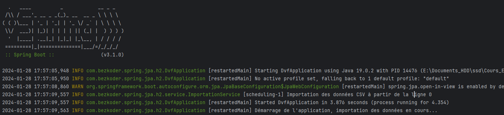
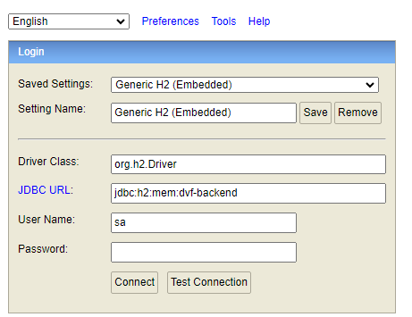
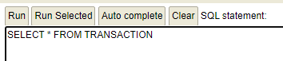

# Projet final : DVF (Demandes de Valeurs Foncières)


Application Java donnant accès aux données de DVF en produisant un
PDF.

L’application DVF « officielle » est accessible à l’adresse suivante :
https://explore.data.gouv.fr/immobilier?onglet=carte&filtre=tous&level=section&lat=46.30000&lng=2.00000&zoom=16.00

Elle se base sur un ensemble de données contenant actuellement 1 532 718 entrées.

## Installation

```bash
git clone https://github.com/Bertrand2808/dvf-backend.git
cd dvf-backend
mvn clean install
```

### Prérequis 

Notez de bien avoir **téléchargé** le fichier csv à l'adresse : https://files.data.gouv.fr/geo-dvf/latest/csv/2023/full.csv.gz
Puis **placez le fichier dans le dossier resources du projet**.
N'oubliez pas de **modifier le fichier application.properties** pour indiquer le chemin du fichier csv.

```bash
csvFilePath=votre_chemin/full.csv
# exemple : csvFilePath=E:/Documents_HDD/ssd/Cours_ESGI/M1/ArchitectureLogicielle/full.csv
```
Pour lancer l'application, il suffit de run DvfApplication, cela lancera l'importation des premières données



## Utilisation

Une fois l'application lancée, il faut se rendre à l'adresse suivante pour consulter les données dans la base de données H2 : http://localhost:8080/h2-console/login.jsp?jsessionid=d9d83c4053435f626aade70ff436a35e





### Utilisation avec le front 

A noter qu'il est préférable de lancer le back avant le front. 

Pour lancer le front, rendez vous ici : https://github.com/Bertrand2808/DVF-front et suivre les instructions du README.md.
